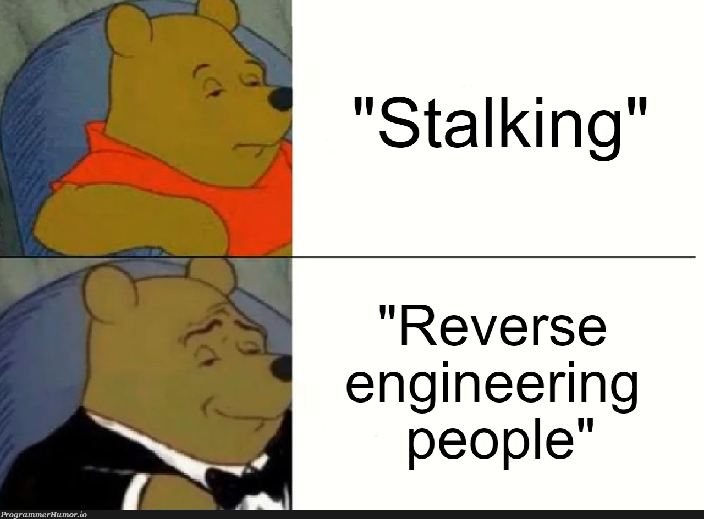
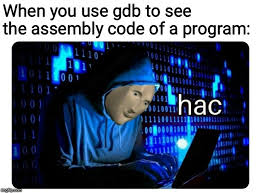

<!-- How to render this file:
     VS Code: install "Marp for VS Code" extension, open this file, click the preview icon
     CLI:     npm install -g @marp-team/marp-cli
              marp presentation.md --pdf        (export to PDF)
              marp presentation.md --html       (export to HTML)
-->

# Module 2: Reverse Engineering
## Reading Binaries You Don't Have Source For

**Cybersecurity Course — Low-Level Security Research**

---

## What You Will Learn

This module teaches you to understand a binary's behavior without its source code.

1. **What is Reverse Engineering** — the detective's mindset
2. **Static Analysis** — reading a binary without running it (`strings`, `objdump`, Ghidra)
3. **Dynamic Analysis** — observing a binary live (GDB, `strace`, `ltrace`)
4. **Finding Vulnerabilities** — recognizing patterns in disassembly and pseudocode
5. **Practical Crackmes** — end-to-end walkthroughs from binary to solution

> Every exploit starts with understanding what the target does. Reverse engineering is how you build that understanding.

---

<!-- SECTION BREAK -->
# Part 1
## What Is Reverse Engineering?

---



---

## What Is Reverse Engineering?

Reverse engineering is the process of understanding how something works by examining it — without access to the original design or source code.

In software security it means: **you have a compiled binary, you have no C source, and you need to figure out what it does.**

```
Source code  ──(compiler)──▶  Binary
                              Binary  ──(you)──▶  Understanding
```

The compiler discarded variable names, comments, and structure.
What you recover is **behavior**: what the program computes, what it checks, where the bugs are.

---

## Why Reverse Engineer?

| Situation | Goal |
|---|---|
| CTF crackme | Find the input that makes it print "Correct" |
| Malware analysis | Understand what a suspicious binary does without running it |
| Vulnerability research | Find bugs in closed-source software |
| Interoperability | Understand an undocumented protocol or file format |
| Exploit development | Know exactly which code path you are hijacking |

---

## The Two Approaches

Every reverse engineering session uses one or both of these:

**Static analysis** — read the binary without running it.
- Safe, complete, but slower
- You see all code paths, including ones that never trigger at runtime

**Dynamic analysis** — run the binary and observe it live.
- Faster for understanding behavior
- You only see what actually executes during that run

They complement each other. A typical session:

```
Static analysis            Dynamic analysis
─────────────────────      ──────────────────────────────
Understand structure   →   Step through those functions
Find interesting           in GDB to confirm your theory
functions
```

---

## What You Are Looking At

When you open a binary, three views are available:

```
Binary bytes      Disassembly (objdump)     Decompiler (Ghidra)
─────────────     ──────────────────────    ───────────────────
55                push   rbp                int check_key(char *input) {
48 89 e5          mov    rbp, rsp
48 83 ec 10       sub    rsp, 0x10              char expected[] = {...};
...               ...                           for (int i = 0; i < 5; i++)
                                                    if ((input[i]^0x13) != expected[i])
                                                        return 0;
                                                return 1;
                                            }
```

**Disassembly** is ground truth — every instruction is real.
**Decompiler output** is a best guess — useful, but always verify against assembly when it matters.

---

## The Detective's Mental Model

Think of a reverse engineer as a detective handed a finished jigsaw puzzle with no picture on the box.

```
The pieces are the bytes.

Static analysis  =  Laying all pieces out and studying their shapes.
Dynamic analysis =  Watching someone else assemble them in real time.
```

Your goal is not to rebuild the box art.

> Your goal is to answer one specific question: **where is the weakness?**

---

<!-- SECTION BREAK -->
# Part 2
## Static Analysis

---



---

## What Is Static Analysis?

Static analysis means examining a binary **without running it**. You read the code, understand the structure, and reason about behavior purely from the file on disk.

**Why use it?**
- Safe — you never execute potentially malicious code
- Works on binaries you cannot run (wrong OS, wrong architecture, requires hardware)
- Reveals all code paths, including ones that are hard to trigger dynamically
- Essential when you need to understand an entire program before writing an exploit

---

## Static Analysis Workflow

```
Binary File
    |
    v
1. Identify the file            (file, checksec)
    |
    v
2. Extract strings              (strings)
    |
    v
3. Examine sections/symbols     (readelf, nm)
    |
    v
4. Disassemble                  (objdump)
    |
    v
5. Decompile                    (Ghidra)
    |
    v
6. Understand logic, find bugs
```

---

## Step 1: Identify the Binary

Before anything else, know what you're dealing with.

```bash
file ./binary
# ELF 64-bit LSB executable, x86-64, dynamically linked, not stripped

checksec --file=./binary
# Arch:     amd64-64-little
# RELRO:    Partial RELRO
# Stack:    No canary found
# NX:       NX enabled
# PIE:      No PIE (0x400000)
```

Key things to note:

| Field | Implication |
|---|---|
| 64-bit or 32-bit | Affects register names and address widths |
| Stripped or not | Stripped = no function/variable names in symbols |
| Dynamically linked | Uses libc externally — look for PLT/GOT |
| PIE enabled | Addresses are position-independent (ASLR applies to code) |

---

## Step 2: Extract Strings

Strings reveal file paths, error messages, format strings, hardcoded credentials, and flags.

```bash
strings ./binary              # all printable sequences >= 4 chars
strings -n 8 ./binary         # minimum length 8 (reduces noise)
strings -t x ./binary         # show hex offset of each string
strings ./binary | grep -i "password\|flag\|secret\|key\|admin"
```

Example output:
```
/lib64/ld-linux-x86-64.so.2
Enter password:
Access granted!
/bin/sh
CTF{...flag...}
```

Any of these is a clue about the program's behavior.

> **Note:** XOR-obfuscated strings won't appear here — they require decompiler analysis.

---

## Step 3: Examine the ELF Structure

```bash
# Section headers (.text, .data, .plt, .got)
readelf -S ./binary

# Symbol table (function names, if not stripped)
readelf --syms ./binary
nm ./binary

# Dynamic symbols (imported functions from libc)
nm -D ./binary
```

### Symbol types from `nm`

```
U = undefined (imported from shared library)
T = defined in .text (code in this binary)
D = defined in .data (initialized global)
```

### Imported functions and what they signal

| Function | Implication |
|---|---|
| `system`, `execve` | Shell execution — possible win condition |
| `strcmp`, `strncmp` | String comparison — password check |
| `gets`, `strcpy` | Potential buffer overflow |
| `printf`, `fprintf` | Potential format string vulnerability |
| `malloc`, `free` | Heap usage |

---

## Step 4: Disassemble with objdump

`objdump` converts machine code bytes into human-readable assembly.

```bash
# Disassemble all code (Intel syntax is more readable)
objdump -d -M intel ./binary

# Disassemble a specific function
objdump -d -M intel ./binary | grep -A 50 "<main>:"

# Hunt for dangerous calls
objdump -d -M intel ./binary | grep -E "call.*(gets|strcpy|printf|system)"
```

### Reading objdump Output

```
0000000000401156 <main>:
  401156:       55                      push   rbp
  401157:       48 89 e5                mov    rbp,rsp
  40115a:       48 83 ec 40             sub    rsp,0x40
  40115e:       bf 10 20 40 00          mov    edi,0x402010
  401163:       e8 c8 fe ff ff          call   401030 <puts@plt>

[address] : [hex bytes]    [assembly instruction]
  401156       55             push rbp
    ^addr      ^machine code  ^human-readable
```

---

## Step 5: Decompile with Ghidra

Ghidra (free, NSA) converts assembly back into C-like pseudocode. It is the primary tool for static analysis of complex binaries.

### Basic Workflow

```
1. File → New Project
2. File → Import File → select your binary
3. Auto-analyze: Yes  (30s–2min depending on size)
4. Symbol Tree (left) → Functions → find main
5. Decompiler window (right) shows C pseudocode
6. Listing window (center) shows disassembly
```

### The Three Panes

```
+------------------+---------------------------+------------------+
| Symbol Tree      |    Listing (Assembly)     |   Decompiler     |
|                  |                           |   (Pseudocode)   |
| Functions:       | 00401156 PUSH RBP         | void main() {    |
|   main           | 00401157 MOV RBP,RSP      |   char buf[64];  |
|   foo            | 0040115a SUB RSP,0x40     |   gets(buf);     |
|   check_pass     | 0040115e MOV EDI,...      |   puts("...");   |
|                  | 00401163 CALL puts        | }                |
+------------------+---------------------------+------------------+
```

---

## Ghidra Keyboard Shortcuts

```
Double-click a function name   →  navigate to it
L                              →  rename label or variable
;                              →  add comment
Ctrl+L                         →  go to address
G                              →  go to specific address
Ctrl+F                         →  search for string or bytes
Right-click → References       →  find all callers of a function
```

> Rename variables and add comments as you go. Ghidra saves them in the project — you build up a picture over time.

---

## Step 6: Finding Vulnerabilities Statically

### Look for Dangerous Functions

```bash
objdump -d -M intel ./binary | grep -E "call.*gets|call.*strcpy|call.*printf"
# or in Ghidra: Search → For Direct References → gets
```

### Trace Data Flow From a Dangerous Call

When you find `gets(buf)`:
1. Find `buf` in the decompiler — what size? (`char buf[64]` → 64 bytes)
2. Return address is at `[rbp + 8]`
3. Offset = buffer size + 8 (saved RBP) = 72 bytes
4. Is there a stack canary? (`checksec` tells you)

### Recognize Password Check Patterns

```nasm
lea  rdi, [user_input]
lea  rsi, [hardcoded_string]   ; address in .rodata
call strcmp
test eax, eax                   ; strcmp returns 0 if equal
jne  .access_denied             ; jump if NOT equal
; fall through to "access granted"
```

---

## Practical Example: XOR Crackme

Ghidra decompiles a crackme binary and you see:

```c
int check_key(char *input) {
    char expected[] = {0x76, 0x60, 0x72, 0x60, 0x7b};
    for (int i = 0; i < 5; i++) {
        if ((input[i] ^ 0x13) != expected[i]) return 0;
    }
    return 1;
}
```

**What the code does:** XOR each input byte with `0x13`. If it matches `expected[i]`, continue. Otherwise reject.

**XOR is its own inverse:**
```
If   A ^ B = C
Then C ^ B = A       (XOR both sides by B)
```

So: `input[i] = expected[i] ^ 0x13`

```python
expected = [0x76, 0x60, 0x72, 0x60, 0x7b]
key = ''.join(chr(b ^ 0x13) for b in expected)
print(key)   # esash
```

> XOR obfuscation is the simplest way to hide a string from `strings ./binary`. As soon as you see `^ 0x13` in the decompiler, it's trivially reversible.

---

<!-- SECTION BREAK -->
# Part 3
## Dynamic Analysis

---

## What Is Dynamic Analysis?

Dynamic analysis means running a binary and observing its behavior in real time.

**Why use it?**
- Reveals runtime values that static analysis cannot (decrypted strings, resolved addresses)
- Essential for understanding how data flows through a program
- Required to verify exploits and measure offsets precisely
- Shows actual memory state: heap contents, stack layout, register values

**Core tools:**

| Tool | Purpose |
|---|---|
| `gdb` | Step through execution at the instruction level |
| `strace` | Trace every system call the program makes |
| `ltrace` | Trace every library function call |

---

## GDB: Install and Start

pwndbg is a plugin that transforms GDB into an exploit development tool.

```bash
git clone https://github.com/pwndbg/pwndbg
cd pwndbg && ./setup.sh
```

### Starting GDB

```bash
gdb ./binary                     # load binary
gdb -p <pid>                     # attach to a running process
gdb --args ./binary arg1 arg2    # pass arguments
```

### Running the Program Inside GDB

```
(gdb) run                          # run with no arguments
(gdb) run arg1 arg2                # run with arguments
(gdb) run < input.txt              # stdin from file
(gdb) run <<< $(python3 -c "print('A'*100)")
(gdb) continue  (or c)             # continue after a pause
(gdb) kill                         # kill the running process
(gdb) quit  (or q)                 # exit GDB
```

---

## Breakpoints

A breakpoint pauses execution when the CPU reaches a specific address or function.

```
(gdb) break main               # break at start of main()
(gdb) break *0x401234          # break at specific address
(gdb) break foo                # break at function foo
(gdb) break *main+42           # break 42 bytes into main

(gdb) info breakpoints         # list all breakpoints
(gdb) delete 1                 # delete breakpoint #1
(gdb) delete                   # delete all breakpoints
(gdb) disable 2                # disable breakpoint #2
(gdb) enable 2                 # re-enable it
```

### Conditional Breakpoints

```
(gdb) break *0x401234 if $rax == 0    # only break if rax == 0
```

### Watchpoints

```
(gdb) watch *0x7fff1234    # break when this address is written
(gdb) rwatch *0x7fff1234   # break when this address is read
```

---

## Stepping Through Code

```
(gdb) next      (n)   # execute one source line, step OVER calls
(gdb) step      (s)   # execute one source line, step INTO calls
(gdb) nexti     (ni)  # execute one INSTRUCTION, step over calls
(gdb) stepi     (si)  # execute one INSTRUCTION, step into calls
(gdb) finish          # run until current function returns
(gdb) until *0x401234 # run until reaching this address
```

> For exploit development, use `ni` and `si` — you're working at the instruction level, not the source line level.

---

## Examining Registers

```
(gdb) info registers          # show all registers
(gdb) info registers rax rbp  # show specific registers
(gdb) print $rax              # print value of rax
(gdb) print/x $rax            # print in hex
(gdb) set $rax = 0x41         # modify a register
```

With pwndbg, registers are shown automatically on every stop with color-coded change highlighting.

```
 RAX  0x0                    RBX  0x0
 RCX  0x7ffff7af2081         RDX  0x7ffff7dcf8c0
 RSI  0x7fffffffe3b8         RDI  0x1
 RSP  0x7fffffffe2c0    ◄── top of stack
 RBP  0x7fffffffe300    ◄── current frame anchor
 RIP  0x401156          ◄── next instruction
```

---

## Examining Memory

Format: `x/[count][format][size] address`

```
Format:   x=hex   d=decimal   s=string   i=instruction   c=char
Size:     b=byte  h=2 bytes   w=4 bytes  g=8 bytes (qword)
```

```
(gdb) x/20gx $rsp             # 20 qwords from RSP in hex
(gdb) x/32bx $rsp             # 32 bytes from RSP in hex
(gdb) x/s 0x402010            # null-terminated string at address
(gdb) x/10i $rip              # disassemble 10 instructions from RIP
(gdb) x/gx $rbp+8             # read return address
```

### pwndbg Smart Commands

```
(gdb) vmmap                   # full virtual memory map
(gdb) heap                    # heap chunks
(gdb) stack 30                # top 30 entries of the stack
(gdb) telescope $rsp 20       # smart-dereference 20 values from RSP
```

---

## Stack Analysis in GDB

### Find the Return Address

```
(gdb) info frame              # show current frame + return address
(gdb) x/gx $rbp+8            # return address is always at [rbp+8]
(gdb) backtrace               # show full call stack
```

### Visualizing the Stack (pwndbg context)

```
pwndbg> context stack

STACK
00:0000│ rsp 0x7fffffffe4c0 ◂— 'AAAAAAAA...'
01:0008│     0x7fffffffe4c8 ◂— 0x4141414141414141
...
08:0040│     0x7fffffffe500 —▸ 0x7fffffffe500  (saved rbp)
09:0048│     0x7fffffffe508 —▸ 0x401189        (return address → main+...)
```

The return address is at offset 9 from RSP in this example — overwrite it and you control `RIP`.

---

## Disassembly and Modifying Execution

### Disassembly in GDB

```
(gdb) set disassembly-flavor intel   # use Intel syntax (recommended)
(gdb) disas main                     # disassemble main
(gdb) disas 0x401156                 # disassemble at address
(gdb) disas 0x401156, +50            # disassemble 50 bytes from address
```

### Modifying Execution (useful for bypassing checks during analysis)

```
(gdb) set $rip = 0x401234         # jump to a different address
(gdb) set $rax = 1                # fake a return value
(gdb) set *(int*)0x7fff1234 = 99  # write to memory
(gdb) jump *0x401234              # jump and continue from address
```

> Modifying `$rax` to `1` before a comparison returns is a fast way to bypass a check during analysis — don't do this in a final exploit, only during exploration.

---

## strace: Trace System Calls

`strace` intercepts every syscall the program makes to the kernel.

```bash
strace ./binary
strace -e trace=read,write,open ./binary   # filter specific calls
strace -o trace.txt ./binary               # save output to file
strace -s 200 ./binary                     # print up to 200 chars of strings
```

Example output:

```
execve("./binary", ["./binary"], ...) = 0
write(1, "Enter password: ", 16) = 16
read(0, "testpass\n", 256) = 9
write(1, "Wrong!\n", 7) = 7
exit_group(1) = ?
```

From this output alone, without any disassembly, you know: the binary prints a prompt, reads input, prints "Wrong!", and exits with code 1.

---

## ltrace: Trace Library Calls

`ltrace` intercepts calls to shared library functions (libc, etc.).

```bash
ltrace ./binary
ltrace -e strcmp ./binary    # only trace strcmp calls
```

Example output:

```
puts("Enter password: ")        = 17
fgets("testpass\n", 64, stdin)  = 0x...
strcmp("testpass", "s3cr3t")    = 1    <- comparison in plaintext!
puts("Wrong!")                  = 8
```

`ltrace` is extremely powerful for crackmes. It often shows you the correct password directly, because the comparison arguments are visible in plaintext before the function runs.

> If a crackme uses `strcmp`, `ltrace` trivially breaks it. The next level of protection is to avoid `strcmp` and use custom comparison logic.

---

## Finding the Buffer Overflow Offset

When exploiting a buffer overflow, you need to know exactly how many bytes reach the return address. Use a cyclic (de Bruijn) pattern.

### Method 1: pwntools cyclic (recommended)

```bash
# Generate a 200-byte cyclic pattern
python3 -c "from pwn import *; print(cyclic(200))"
# aaaabaaacaaadaaae...
```

```
(gdb) run
# paste the pattern as input
# program crashes with:  RIP: 0x6161616b

# Find the offset
python3 -c "from pwn import *; print(cyclic_find(0x6161616b))"
# Output: 44   <- 44 bytes to reach the return address
```

### Method 2: Manual Calculation from Ghidra/objdump

```bash
# From disassembly: sub rsp, 0x50 → buffer is at [rbp - 0x50]
# Return address:   always at [rbp + 0x8]
# Offset = 0x50 (buf to rbp) + 0x8 (saved rbp) = 0x58 = 88 bytes
```

---

## Practical Debugging Session

```bash
$ gdb -q ./vuln

pwndbg> break main
pwndbg> run

pwndbg> disas main
   0x000000000040115a <+4>:  sub    rsp,0x40
   ...
   0x0000000000401163 <+13>: call   0x401040 <gets@plt>

pwndbg> break *0x401163
pwndbg> continue

# stopped before gets is called
pwndbg> x/gx $rbp+8
0x7fffffffe4f8: 0x00007ffff7de2083     <- legitimate return address

pwndbg> ni                              # step into gets (waits for input)
# type: AAAAAAAAAAAAAAAAAAAAAAAAAAAAAAAAAAAAAAAAAAAAAAAAA (50 A's)

pwndbg> x/gx $rbp+8
0x7fffffffe4f8: 0x4141414141414141     <- return address OVERWRITTEN
```

Replace `0x4141...` with a real address → code execution.

---

<!-- SECTION BREAK -->
# Hands-On Exercises

---

## What's in the exercises/ directory

Five crackmes in order of difficulty. Each one introduces a new technique.

| # | Name | Primary Technique | Difficulty |
|---|------|-------------------|------------|
| **01** | Strings Hunt | `strings`, `objdump` | Easy |
| **02** | XOR Crackme | Ghidra + Python | Easy–Mid |
| **03** | Runtime Token | GDB — inspect memory at runtime | Mid |
| **04** | Serial Validator | Static + Dynamic combined | Mid |
| **05** | ltrace Interception | `ltrace` | Mid |

```bash
# One-time setup
echo 0 | sudo tee /proc/sys/kernel/randomize_va_space

# Compile all
gcc            -o crackme-01 crackme-01.c
gcc            -o crackme-02 crackme-02.c
gcc -g         -o crackme-03 crackme-03.c
gcc -g -O0     -o crackme-04 crackme-04.c
gcc            -o crackme-05 crackme-05.c
```

---

## Connecting the Concepts

| Concept | Where it appears |
|---|---|
| ELF format | `file`, `readelf` — structure before loading |
| Strings | `strings` — quick recon, catches hardcoded secrets |
| Symbols | `nm`, `readelf --syms` — function names and imports |
| Disassembly | `objdump` — ground-truth instructions |
| Decompilation | Ghidra — C pseudocode from assembly |
| Vulnerability patterns | `gets`, `strcmp`, `printf` in disassembly |
| XOR obfuscation | Decompiler reveals the key; Python reverses it |
| GDB breakpoints | Pause execution at any address |
| Register inspection | See actual values flowing through the program |
| Memory examination | Read the stack, heap, and code at runtime |
| Cyclic patterns | Find the exact offset to the return address |
| strace / ltrace | Understand behavior from syscalls and library calls alone |

---

## The Key Takeaway

> The binary is the program. The source code is gone. But the behavior is all still there — in the bytes, in the instructions, in the runtime state.

Static analysis gives you the map. Dynamic analysis lets you walk the terrain.

Every exploit technique in modules 3 and 4 requires understanding the target binary first:

```
1. Run strings, checksec, readelf     →  quick picture of the binary
2. Open in Ghidra                     →  find the interesting functions
3. Confirm with objdump               →  verify every critical instruction
4. Run in GDB                         →  measure offsets, observe runtime state
5. Identify the vulnerability         →  now you're ready to exploit
```

---

## What Comes Next

**Module 3 — Binary Exploitation**

- Stack overflows — overwrite the return address (you've seen the setup)
- Return-Oriented Programming (ROP) — chain gadgets to bypass NX
- Format string exploitation — arbitrary read and write via `%n`
- Heap exploitation — corrupting `malloc`'s internal chunk structures

**Module 4 — Kernel Exploitation**

- Linux kernel internals and how to debug the kernel with QEMU + GDB
- Kernel vulnerability classes (UAF, OOB write, race conditions)
- Privilege escalation techniques from a kernel bug

> Everything you've learned here — reading disassembly, using GDB, tracing syscalls — applies directly to kernel debugging. The tools are the same; the target is deeper.

---

## References

| Topic | Source |
|---|---|
| Reverse engineering methodology | *Practical Reverse Engineering* — Bruce Dang et al. |
| Reading disassembly, identifying patterns | *Practical Reverse Engineering* — Ch. 1 (x86 and x86-64) |
| Finding vulnerabilities statically | *The Art of Software Security Assessment* — Dowd, McDonald & Schuh, Ch. 6 |
| GDB usage: breakpoints, stepping, memory | [GDB official documentation](https://www.gnu.org/software/gdb/documentation/) |
| pwndbg: `vmmap`, `heap`, `telescope`, `cyclic` | [pwndbg documentation](https://pwndbg.re/pwndbg/) |
| `strace` and `ltrace` for runtime tracing | *The Linux Programming Interface* — Michael Kerrisk |
| Cyclic patterns for offset finding | [pwntools documentation — `cyclic`](https://docs.pwntools.com/en/stable/util/cyclic.html) |
| Ghidra usage and workflow | [Ghidra official documentation](https://ghidra-sre.org) |
| ELF format, sections, dynamic linking | [ELF-64 Object File Format spec](https://uclibc.org/docs/elf-64-gen.pdf) |
